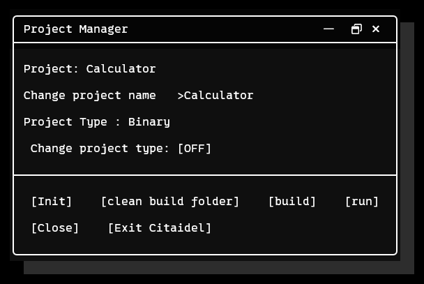
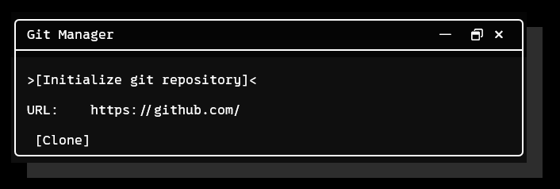

<div align="center">
	
	<h1>Citaidel</h1>
	<h3>C/C++ CMake IDE</h3>
	<h4>Screenshot</h4>
	
</div>

## What is Citaidel

Citaidel is a C/C++ IDE built with LITW.
Citaidel uses CMake as the build system.

## Usage

### Pre

To use Citaidel, you need these things.

 - C/C++ Compiler
 - [CMake](https://cmake.org/)
 - [Git](https://git-scm.com/)


### Project Manager



#### Initialization

After opening Project Manager from the start menu, set your disired project name and type.

| Project Types  |
| -------------- |
| Binary         |
| Static Library |

Click init and It will create a new project folder with folders and CMakeLists.txt.

#### Building and Running

To build or run a Citaidel project, you must be in a folder with CMakeLists.txt or with CMakeLists.txt in the parent directory.

### Git Manager



#### Initializing a Git Repository

To initialize a Git repository, click the `Initialize git repository` to initialize a fresh repository, or clone from a url.

---

## Building Citaidel


#### Dependencies

- [Lad in the Window](https://github.com/Ladsm/Lad-in-the-Window/tree/master)
- CMake

#### Building part

```sh
git clone https://github.com/Ladsm/Citaidel
cd Citaidel
mkdir build
cd build
```

##### Windows

```sh
cmake.exe ..
cmake.exe --build . --config Release
.\Release\Citaidel.exe
```

##### Linux

```sh
cmake ..
cmake --build . --config Release
./Citaidel.exe
```

By Ladsm